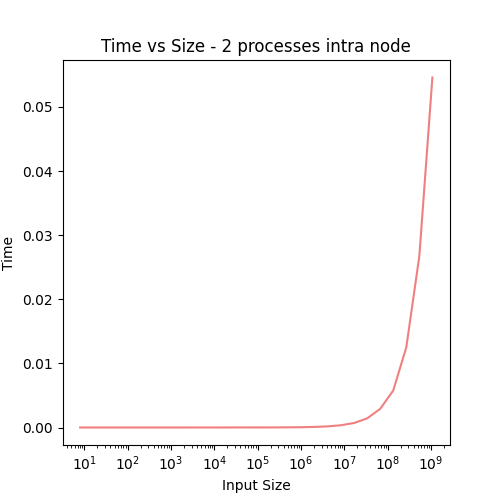
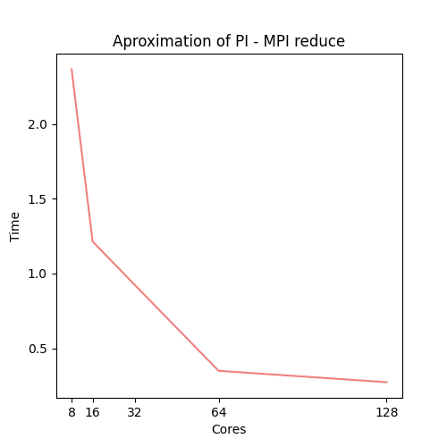

# Instructions: 

The code for this report can be found at https://github.com/druskus20/methods-high-performance-computing-public

For compiling the code we use `cc` or `mpicc` (locally).

I am running all the code on a node with 128 cores. Allocated with:

```
salloc --mem 10000 --nodes=1 -t 00:30:00 -A edu24.DD2356 -p shared --ntasks-per-node=128 --cpus-per-task=2
```

# Exercise 1 

```c
#include <stdio.h>
#include <mpi.h>

int main(int argc, char **argv)
{
    int i, p, r, s;
    MPI_Init_thread(&argc, &argv, MPI_THREAD_SINGLE, &p);
    MPI_Comm_size(MPI_COMM_WORLD, &s);
    MPI_Comm_rank(MPI_COMM_WORLD, &r);
    printf("Hello World from rank %d from %d processes!\n", r, s);
}
```

I compiled the exercise with: 

``` 
cc ex1.c -o ex1
```

Finally I ran:

```
srun -n 4 ./ex1
Hello World from rank 2 from 4 processes!
Hello World from rank 3 from 4 processes!
Hello World from rank 0 from 4 processes!
Hello World from rank 1 from 4 processes!
```

# Exercise 2

```
pedrobg@uan01:~/A3> cc ex2.c  -o ex2
pedrobg@uan01:~/A3> srun -n 2 ./ex2
         8          0.000000776
        16          0.000000295
        32          0.000000256
        64          0.000000258
       128          0.000000276
       256          0.000000324
       512          0.000000418
      1024          0.000000608
      2048          0.000000975
      4096          0.000001445
      8192          0.000000706
     16384          0.000001136
     32768          0.000001841
     65536          0.000003401
    131072          0.000006065
    262144          0.000011678
    524288          0.000019350
   1048576          0.000033195
   2097152          0.000059439
   4194304          0.000099789
   8388608          0.000384907
  16777216          0.001755560
  33554432          0.002773836
  67108864          0.004558827
 134217728          0.008521297
 268435456          0.016182613
 536870912          0.031819208
1073741824          0.062039224
```

In order to plot the data I used a mix of python and VIM to shape the numbers into the right format. It can be found in the repository.

{ width=300px }

{ width=300px }

# Exercise 3

```
pedrobg@uan01:~/A3> cc ex3.c -o ex3
pedrobg@uan01:~/A3> srun -n 8 ./ex3
My rank 0 of 8
Here are my values for f including ghost cells
0.000000
0.000000
0.049066
0.098014
0.146726
0.195085
0.242973
0.290276
0.336880
0.382673
0.427543
0.471384
0.514089
0.555556
0.595684
0.634378
0.671543
0.707090
0.000000
```

#### Why MPI_Send and MPI_Recv are called "blocking "communication?
 
They are blocking because they block the execution of the program until the
communication is completed. This means that the program will not continue until
the message is sent or received. The alternative would be something like an asyncronous
send/receive in which someone (an async runtime, possibly) is responsible for polling the
results periodically.


# Exercise 4

```
pedrobg@uan01:~/A3> cc ex4.c  -o ex4
pedrobg@uan01:~/A3> srun -n 128 ./ex4
The result is 0.024541
The time is: 0.334086s
```

In order to compare the effect of the number of CPUs I created a script as follows:

```
rm -rf ex4_results.txt
touch ex4_results.txt

for t in 8 16 32 64 128; do
  srun -n $t ./ex4 >> ex4_results.txt
done
```

{ width=300px }
